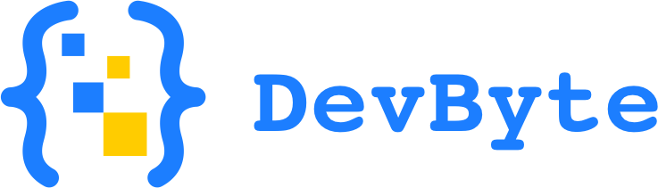

  

# DevByte Community

Welcome to **DevByte** 👋🏽 — a growing community of developers, designers, and tech enthusiasts dedicated to collaboration, knowledge-sharing, and open-source contributions.  

---

## 🌍 About Us
DevByte is more than just a group of developers.  
We are a **community-driven initiative** that connects people across different skill levels and backgrounds, helping them learn, build, and grow together.  

Our focus:
- 🤝 Collaboration through open-source projects  
- 📝 Knowledge-sharing via blogs, articles, and discussions  
- 📅 Community events and workshops  
- 🚀 Building impactful solutions with real-world value  

---

## 💡 What We Do
- **Open-Source Projects**: Collaborative software projects led and maintained by the community.  
- **Mentorship & Learning**: Helping new developers grow through guidance and peer learning.  
- **Community Platform**: Tools and spaces that connect members worldwide.  
- **Events**: Hackathons, meetups, and knowledge sessions to engage and inspire.  

---

## 🛠️ How to Get Involved
Everyone is welcome! Here’s how you can join us:
1. 🌐 Explore our [repositories](https://github.com/DevByte-Community).  
2. 💬 Join discussions and share your ideas.  
3. 🛠️ Contribute to projects — no contribution is too small.  
4. 🚀 Propose new initiatives that strengthen the community.  

---

## 👥 Our People
DevByte is powered by volunteers who dedicate time and skills to make the community thrive.  

- **Engineering Lead**: [Tobechi Duru](https://github.com/Tobe01)  
- **Contributors & Volunteers**: See our [community members](https://github.com/orgs/DevByte-Community/people).  

---

## 📜 License
All repositories under the DevByte Community are licensed under the [MIT License](LICENSE) unless stated otherwise.  

---

✨ Building together. Growing together. ✨

